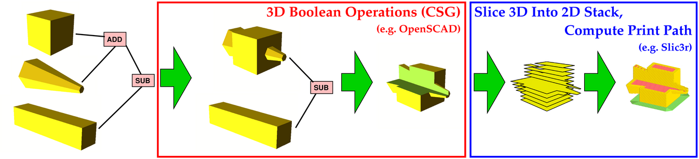
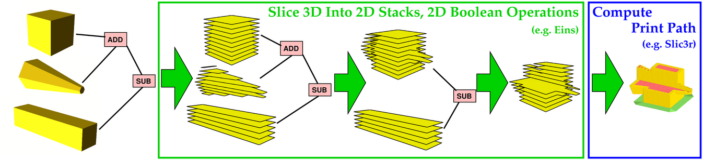
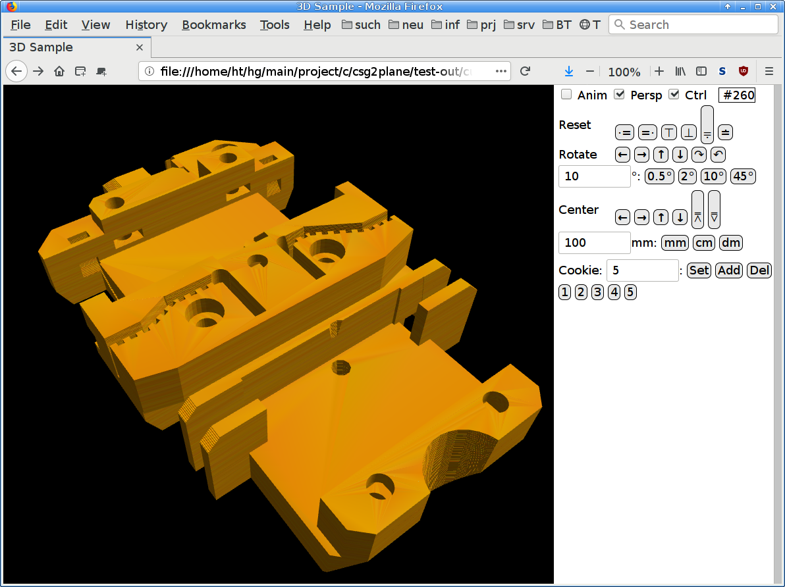
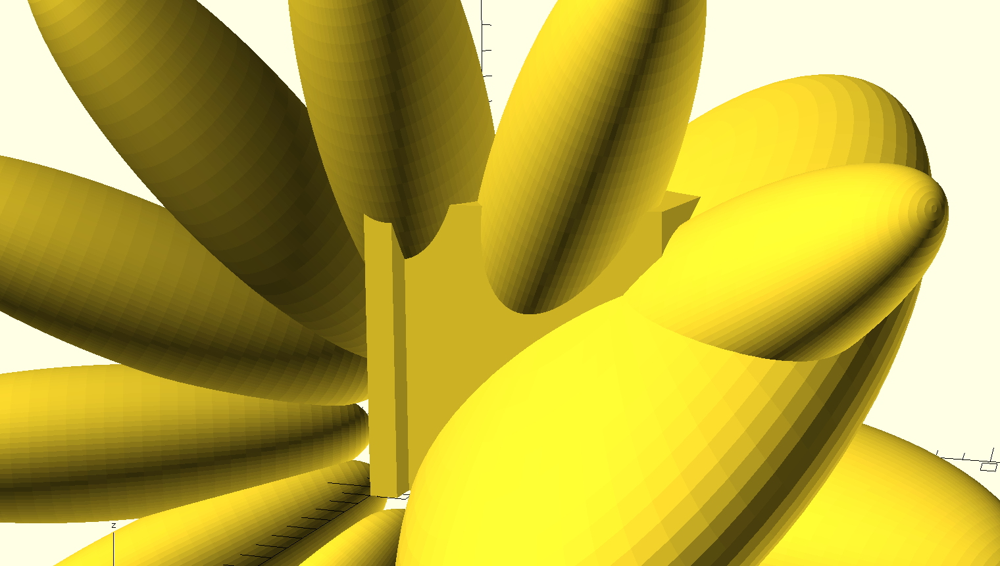
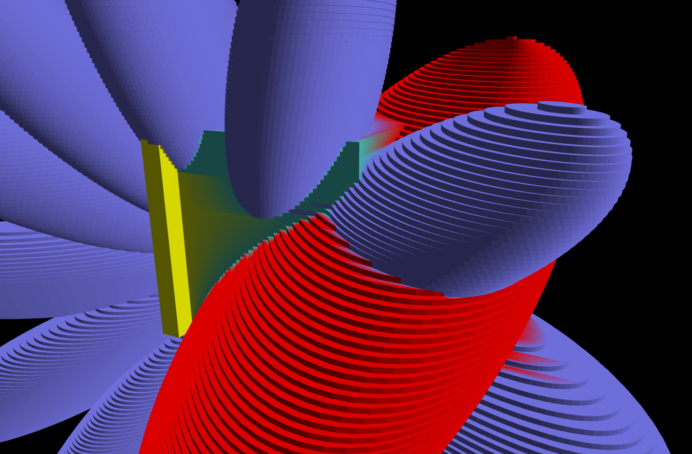
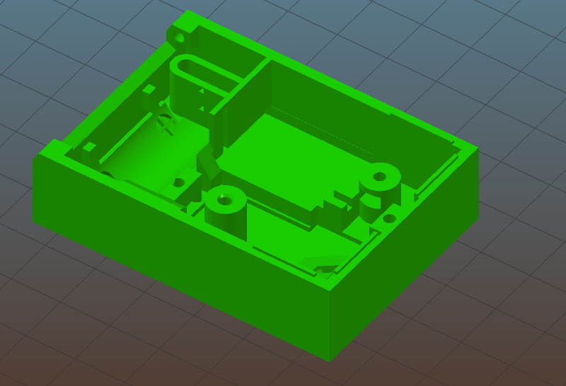
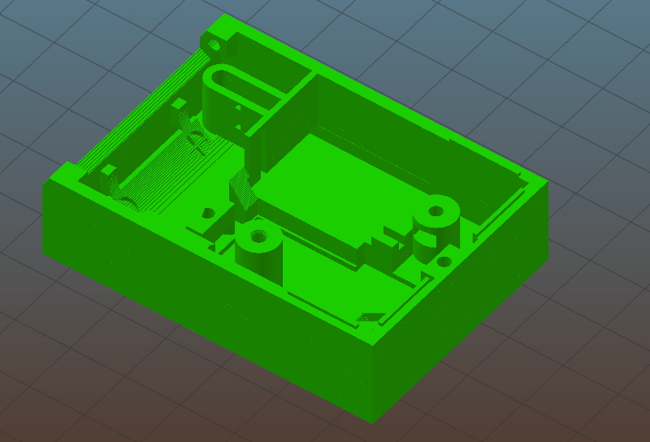
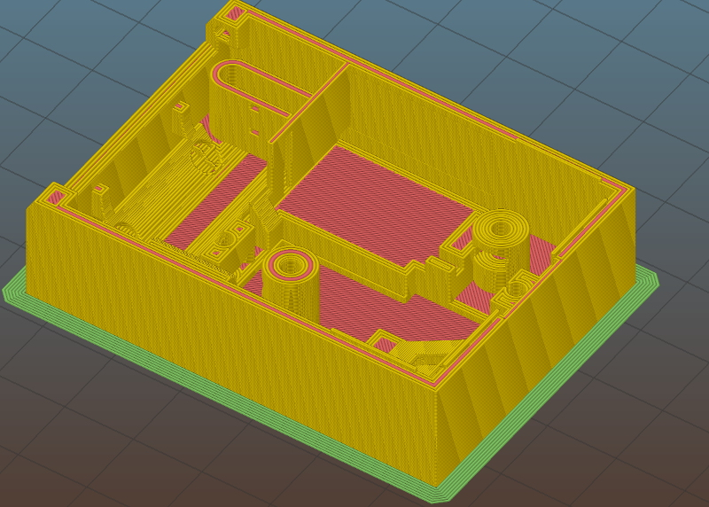

# Hob3l
100x Faster Slicing of SCAD Files for 3D Printing

## What is This?

  * C library for robust polygon boolean operations, i.e., 2D polygon
    operations ADD, SUB, CUT, and XOR; plus polygon triangulation, and
    cutting a 2D slice from a 3D object
  * C library for reading SCAD (OpenScad) files and writing STL files
  * Command line tool for reading SCAD and writing STL files for 3D printing

The focus is on speed and robustness. OpenSCAD's conversion to STL is
slow, because it produces a 3D object.  And the CGAL library (used by
OpenSCAD) does not seems to be very robust for 3D calculations: I
often get spurious error messages about a non-2-manifold polyhedron.

Instead, Hob3l produces an STL file suitable for 3D printing.  It does
that by pre-slicing the SCAD file into layers and using only 2D
operations on each layer.  The 2D operations are much faster than 3D
operations.  Also, Hob3l is very robust -- the 2D base library was
fuzzed to try to get rid of any numeric instability problems that
might hide somewhere.

This is a major overhaul of the internals of Hob3l to get it as robust
as possible.  Internally, it now uses 32-bit integer arithmetics with
exact intersection point math (based on 160 bit fractionals) and a
snap rounding algorithm to stay within the input coordinate precision.
It reads and writes normal floating point numbers, and the float<->int
conversions are exact within `float` precision (the native STL binary
number format).  If necessary, the precision can be scaled (by
default, the unit is 1/8192mm).

## Replace 3D CSG by Fast 2D Polygon Clipping

Preparing a 3D model in CSG format (e.g., when using
[OpenSCAD](http://www.openscad.org/))
for printing may take a long time and is often computationally instable.

So Hob3l wants to replace a workflow 'apply 3D CSG, then slice, then print':


by a workflow 'slice, then apply 2D CSG, then print':



The latter work flow is much faster, especially for non-trivial examples,
and has much better computational stability.

The idea is explained in more detail
[in my blog](http://www.theiling.de/cnc/date/2018-09-23.html).

Hob3l's main output formats are

  * STL for printing
  * JavaScript/WebGL for viewing and prototyping

## OpenSCAD

The purpose of this project is definitely not to rant about
[OpenSCAD](http://www.openscad.org/).
It is a great tool that I am also using.

But this is about a pre-slicing technique for rendering CSG (or SCAD
format) into STL that is suited for 3D printing.  The resulting STL is
no smooth, but looks just like the 3D printed result: it has layers.

## Table of Contents

  * [Replace 3D CSG by Fast 2D Polygon Clipping](#replace-3d-csg-by-fast-2d-polygon-clipping)
  * [OpenSCAD](#openscad)
  * [Table of Contents](#table-of-contents)
  * [SCAD Input Format](#scad-input-format)
  * [Status, Stability, Limitations, Future Work, TODO](#status-stability-limitations-future-work-todo)
  * [Supported Output Formats](#supported-output-formats)
  * [JavaScript/WebGL Output](#javascriptwebgl-output)
  * [Building](#building)
      * [Different Build Variants](#different-build-variants)
      * [Different Compiler Targets](#different-compiler-targets)
      * [Tweaking Compiler Settings](#tweaking-compiler-settings)
  * [Running Tests](#running-tests)
  * [Installation](#installation)
  * [Using This Tool, Command Line Options](#using-this-tool-command-line-options)
      * [Tweaking Command Line Settings](#tweaking-command-line-settings)
  * [Algorithmic Improvements](#algorithmic-improvements)
  * [Speed comparison](#speed-comparison)
  * [Rendering Differences](#rendering-differences)
  * [Name](#name)

## SCAD Input Format

The Hob3l tool reads a subset of the SCAD format used by OpenSCAD.

Please check [the SCAD format documentation](doc/scadformat.md) for a
definition of the subset of SCAD that is supported by Hob3l.

To use the full SCAD format syntax, OpenSCAD can be used as a
preprocessor to Hob3l:

```
    openscad thing.scad -o thing.csg
    hob3l thing.csg -o thing.stl
```

See [Using This Tool](#using-this-tool-command-line-options).

## Status, Stability, Limitations, Future Work, TODO

After a major overhaul, this tool has been tested very thoroughly
wrt. stability and arithmetic robustness, in order to get rid of any
floating point instabilities.

The tool can read the specified subset of SCAD (e.g. from OpenSCAD's
CSG output), it can slice the input object, it can apply the 2D
boolean operations (AKA polygon clipping), and it can triangulate the
resulting polgygons, and write STL.  Slic3r (and probably PrusaSlicer
and Cura) can read the STL files Hob3l produces.

The input polyhedra must be 2-manifold.  However, in contrast to
previous versions, Hob3l now accepts quite a few non-2-manifold
polyhedra.  Polyhedra with holes, however, will not work.  OpenSCAD
(or CGAL) probably now has more constraints on well-formedness than
Hob3l.  E.g., Hob3l's algorithms are robust against wrong handedness
of faces.

The output STL contains separate layers instead of a single solid.
This may be fixed in the future to generate contiguous polyhedra.  For
now, if you hit `split` e.g. in slic3r, you'll get hundreds of
separate layer objects -- which is not useful.

Memory management has leaks.  I admit I don't care enough, because
Hob3l basically starts, allocates, exits, i.e., it does not run for
long, so the memory leaks do not build up.

There are never enough tests.  However, Hob3l's core algorithms have
survived many millions of fuzzing tests with `afl`.

Many tests only check for the absence of a crash or assertion failure,
but whether the algorithm works correctly needs to be inspected by a
human.  Usage of this tool for a few years, however, seems to hint
that it does what it is supposed to do.

## Supported Output Formats

`STL`: The output format of Hob3l for which it was first developed, is
STL.  This way, the input SCAD files can be converted and directly
used in the slicer for 3D printing.

`PS`: For debugging and documentation, including algorithm
visualisation, Hob3l can output in PostScript.  This is how the
overview images on this page where generated: by using single-page PS
output, converted to `PNG` using `GraphicsMagick`.  For debugging,
mainly multi-page debug PS output was used, which allows easy browsing
(I used `gv` for its speed and other nice features). Also, this allows
to compare different runs and do a step-by-step analysis of what is
going on during the algorithm runs.  The PS modules has a large number
of command line options to customise the output.

`JS/WEBGL`: For prototyping SCAD files, a web browser can be used as a
3D model viewer by using the JavaScript/WebGL output format.  The SCAD
file can be edited in your favourite editor, then for visualisation,
Hob3l can generate WebGL data (possibly with an intermediate step to
let OpenSCAD simplify the input file using its .csg output), and a
reload in the web browser will show the new model.  This package
contains auxiliary files to make it immediately usable, e.g. the
surrounding .html file with the WebGL viewer that loads the generated
data.  See the `hob3l-js-copy-aux` script.  The overhaul of Hob3l
removed colour support for JS output -- it's just not the most
important thing...

`SCAD`: For debugging intermediate steps in the parser and converter,
SCAD format output is available from several processing stages.  The
current version of Hob3l does not need polyhedra to be strictly
correct like in OpenSCAD (e.g., handedness of faces may be reversed).
For this reason, polyhedra may not be strictly correct when printed in
SCAD debug output and then loaded into OpenSCAD for inspection.  (Note
that STL and JS output do produce correctly oriented faces.)

## JavaScript/WebGL Output

Here's a screenshot of my browser with a part of the
[Prusa i3 MK3](https://github.com/prusa3d/Original-Prusa-i3)
3D printer rendered by Hob3l:



There is an [online version available
here](http://www.theiling.de/cnc/gl-curryhob3l/curry.html) to play
with.

The conversion from `.scad` to `.js` takes about 0.7s on my machine,
so this is very well suited for prototyping: write the `.scad` in a
text editor, run 'make', reload in browser.  To run this conversion
yourself, after building, run:

```
    make clean-test
    time make test-out/curry.js
```

This should print something like:

```
./hob3l.exe scad-test/curry.scad -o test-out/curry.js.new.js
Info: Z: min=0.1, step=0.2, layer_cnt=75, max=14.9
mv test-out/curry.js.new.js test-out/curry.js

real  0m0.650s
user  0m0.592s
sys   0m0.044s
```

## Building

Building relies on GNU make and gcc, and uses no automake or other
meta-make layer.  Both Linux native and the MingW Windows cross
compiler have been tested, and I hope that the MingW compiler will
also work when run natively under Cygwin.

Make variables can be used to switch how the stuff is compiled.  Some
GCC extensions are used, but I tried not to overdo it with gcc
extensions (`({...})` and `__typeof__` are used frequently, though),
it should be compilable without too much effort.

One unusual step is the generation of the font files (for the `text`
command, which is currently not completely implemented, but the files
are needed already for compilation).  The font files are generated by
a tool `fontgen`, which needs to be compiled and run.  The font files
are not checked in, because they are quite large (about 10 .c files
each ~2 MB), and they tend to change a lot even for minute changes to
the font.  This would cause huge diffs.  So the first step is to
generate them:

```
    make font
```

This only needs to be done once (even when switching compilation
targets).  The font files are not deleted even with `make distclean`
or similar (only `make font-clean` and `make zap` remove them), so
now the compilation goes on normally:

```
    make clean
    make
    make test
```

The resulting executable is called 'hob3l.exe' (also under Linux --
this is so that it also works under Windows).

Parallel building should be fully supported using the `-j` option to
make.

Some Perl scripts are used to generate C code, but all generated C
code is also checked in, so the scripts are only invoked when changes
are made.

### Different Build Variants

The makefile supports 'normal', 'release', and 'devel' build variants,
which can be switched using the `MODE=normal` (default),
`MODE=release`, or `MODE=devel` command line variables for make.  The
selection is stored in a file `.mode.d`, so next time you invoke
'make' without a `MODE` parameter, the previous build variant will be
chosen.

E.g.:

```
    make clean
    make MODE=release
    make test
```

### Different Compiler Targets

To compile with the standard 'gcc', whatever that is, for x86:

```
    make
```

To compile with gcc for x86_64 (e.g., 64 bit x86 Linux):

```
    make TARGET=gcc64
```

To compile with gcc for i686 (e.g., 32 bit x86 Linux):

```
    make TARGET=gcc32
```

To compile with Clang:

```
    make TARGET=clang
```

To cross compile for Windows 64 using MingW:

```
    make TARGET=win64
```

To cross compile for Windows 32 using MingW:

```
    make TARGET=win32
```

You can set the exact compiler name by overriding `CC`:

```
    make TARGET=win32 CC=my-funny-mingw-gcc
```

### Tweaking Compiler Settings

The Makefile has more settings that can be used to switch to other compilers
like clang, or to other target architectures.  This is not properly documented
yet, so reading the Makefile may be necessary here.

The most likely ones you may want to change are the following (listed
with their default setting):

```
CFLAGS_ARCH  := -march=native
```

## Running Tests

After building, tests can be run, provided that the 'hob3l.exe'
executable can actually be executed (hopefully).  On systems where it
works, use

```
    make test
```

for that.  This runs both the unit tests as well as basic SCAD
conversion tests.  For full set of checks (asserts) during testing,
the 'devel' build variant should be used in addition to the actual
build variant.

After installation, the SCAD conversion tests can be run with the
installed binary by using

```
    make check
```

Each time `make check` is invoked, it will first remove the old test
output files to make sure that the check is actually run.  `make
check` also honours the `DESTDIR` variable to construct the path to the
installed executable in the same way as `make install`.

## Installation

The usual installation ceremony is implemented, hopefully according to
the GNU Coding Standard.  I.e., you have `make install` with `prefix`,
and all `*dir` options and also `DESTDIR` support as well as
`$(NORMAL_INSTALL)` markers, and also `make uninstall`.

```
    make DESTDIR=./install-root prefix=/usr install
```

For better package separation, the `install` target is split into
`install-bin`, `install-data`, `install-lib`, `install-include`
(e.g. to have a separate `-dev` package as in Debian distributions).

Unfortunately, there is no `install-doc` yet.  FIXME.

The package name Hob3l can be changed during installation using the
`package_name` variable, but this only changes the executable name and
the library name, but not the include subdirectory, because this would
not work as the name is explicitly used in the header files.

## Using This Tool, Command Line Options

In general, use `hob3l --help`.

To convert a normal scad file into the subset this Hob3l can read,
start by using OpenSCAD to convert to a flat 3D CSG structure with all
the syntactic sugar removed.  This conversion is fast.

```
    openscad thing.scad -o thing.csg
```

You can now use Hob3l to slice this directly instead of applying
3D CSG:

```
    hob3l thing.csg -o thing.stl
```

This can then be used in your favorite tool for computing print paths.

```
    slic3r thing.stl
```

### Tweaking Command Line Settings

The underlying technique of Hob3l is computationally difficult,
because it relies on floating point operations.  The goal was
stability, but it turned out to be really difficult to achieve, so
Hob3l might still occasionally fail.  If this happens, the following
command line options change internal settings that might push the tool
back on track:

```
    --max-simultaneous=N    # decrease for better stability; min. is 2
```

The following options also have an influence, but neither large nor
small is really better -- changing them causes different perturbations
and thus different results, some of which might be more likely to
succeed.  A good heuristics is to keep `gran` larger than `eps` and
let `eps2` be about the square of `eps`.

```
    --gran=X
    --eps=X
    --eps2=X
```

Computing the difference between adjacent layer (e.g. for JS/WebGL
output) often has to deal with very close points, so switching this
off often helps to move forward, too.  Of course, this may produce
output that is less nice.

```
    --no-diff
```

## Algorithms

The polyhedra (from SCAD input files) are processed using `double`
coordinates.  The 2D algorithms, however, now use 32-bit integer
coordinates for exact math (and can handle 31-bit signed values
without overflow).  Therefore, the coordinates in a polygon slice cut
from a polyhedron are converted from `double` to `int` by multiplying
by a power of two -- this way, the upper bits of the floating point
mantissa (53 bits for `double`) can be used directly as ints with
minimum rounding error.  When converting back from `int` to `double`,
the integer coordinates are divided by the same power of two, meaning
that no rounding error occurs: the integer is used directly as the
upper mantissa bits for the floating point number (the lower bits are
0).  A round trip from int to double to int is then loss-less.  As
binary STL uses `float` coordinates (with a 24 bit mantissa, smaller
than 32-bit integers), care was taken to scale in such a way that a
wide range of float coordinates also convert to STL with no rounding
error.  And the ASCII STL is printed with many significant digits to
ensure that the information gets into the slicer without any loss of
precision.  All integer operations check for overflow so that the
scale value can be adjusted if necessary for weird input files.

The slice algorithm used to cut a polygon slice from a polyhedron is a
simple ad-hoc algorithm that works by iterating each face, making a
cut at a given z height, sorting the cut points, and interpreting them
as line segments.  The subsequent algorithms need no particular order
of edges, so a very simple algorithm can be used for slicing.

The polygon clipping algorithm is a Bentley-Ottmann 1979 (Algorithms
for reporting and counting geometric intersections) plane sweep
algorithm using exact fractional math for the intersections.  Ideas
from Mart&iacute;nez, Rueda, Feito 2009 (A new algorithm for computing
Boolean operations on polygons) were used to extend Bentley-Ottmann to
corner cases like overlapping edges.  Also, the inside/outside
information is tracked in a way similar to that paper, extended by
ideas from Sean Conelly's polybooljs project.  The input/output
information was then extended to handle more than two polygons at
once, by using a boolean function represented by a bit array.  This
speeds up the 2D processing.

The ideas from Boissonnat and Preparata 2000 (Robust Plane Sweep for
Intersecting Segments) helped examine the complexity of the numeric
problems and to construct a data type for storing intersection points
exactly: with a 160 bit fractional (32 bit integer + 64 bit
numerator + 64 bit denominator).  This avoids overheads from generic
exact math libraries and it is quite fast.

After the intersection algorithm, the snap rounding algorithm by de
Berg 2007 (An Intersection-Sensitive Algorithm for Snap Rounding) is
run to fit the intersection coordinates back into the input bit width
(32-bit integer coordinates).

To get a triangulation (to produce the output polyhedron in STL
format), the triangulation algorithm of Hertel & Mehlhorn 1983 (Fast
Triangulation of the Plane with Respect to Simple Polygons) was used
and extended to support coincident vertices, because these cannot be
avoided.  Also, sequences of collinear edges are supported.

The same algorithm was adapted also for constructing a polygon outline
from the set of edges produced by the preceding algorithm, if no
triangulation is needed.  This is used in the SCAD language
processing, e.g., with operations like extrude or project, where the
result of the 2D boolean algorithm is fed back into the CSG tree.

## Speed comparison

Depending on the complexity of the model, Hob3l may be much faster
than using OpenSCAD with CGAL rendering.

Some examples:

The x-carriage.scad part of my
[Prusa i3 MK3](https://github.com/prusa3d/Original-Prusa-i3)
printer from the Prusa github repository: let's first convert it
to `.csg`.  This conversion is quickly done with OpenSCAD, and the
resulting flat SCAD format is what Hob3l can read:

```
    time openscad x-carriage.scad -o x-carriage.csg
    0m0.034s
```

To convert to STL using openscad 3D CSG takes a while:

```
    time openscad x-carriage.csg -o x-carriage.stl
    0m45.208s
```

Doing the same with Hob3l in 0.2mm layers is about 50 times faster:

```
    time hob3l x-carriage.csg -o x-carriage.stl
    0m0.824s
```

The most complex part of the i3 MK3 printer, the `extruder-body.scad`,
before it was reimplemented as `step` file, takes 2m42s in openscad to
convert to STL, while Hob3l takes 1.24s, again with 0.2mm layers.
That is 130 times faster.

For one of my own parts `useless-box+body`, which is less complex, but
does not care much about making rendering fast (I definitely set up
cylinders with too many polygon corners):

```
    time openscad uselessbox+body.scad -o uselessbox+body.stl
    0m53.433s

    time hob3l uselessbox+body.scad -o uselessbox+body.stl
    0m0.610s
```

This is 85 times faster.  Over half of the time is spent on writing
the STL file, which is 23MB -- STL is huge.  Loading and converting
only takes 0.23s.

You can push the difference in speed by making the model more complex,
particularly when using high detail levels.  E.g., the test31b.scad
example uses `$fn=99` for a few ellipsoids, causing openscad to slow
down:

```
time openscad scad-test/test31b.scad -o test31b.stl
4m30.198s
```

In contrast, the different algorithms used by Hob3l do not slow down
much:

```
time ./hob3l.exe scad-test/test31b.scad -o test31b.stl
0m0.748s
```

This is 350 times faster.  The difference is of course that with
Hob3l, the result is sliced into layers, as the following image
demonstrates.  The top is the OpenSCAD F6 view, the bottom is Hob3l's
WebGL output in my web browser.





## Rendering Differences

The difference of the conversion technique is visible in the model
view of the STL, where the 2D CSG slicing technique clearly shows the
layers, e.g. for a real-life example sliced a 0.2mm with Hob3l.  The
top is OpenSCAD's output in Slic3r, the bottom is Hob3l's output in
Slic3r:




The final result of the slicer, however, is indistinguishable (I was
unable to replicate the exact same view, so the Moir&eacute; patterns
are different -- but the result is really the same), again OpenSCAD
output top, Hob3l bottom:




## Name

The name Hob3l derives from the German word 'Hobel', which is a
'planer' (as in 'wood planer') in English.  The 'e' was turned to `3`
in recognition of the `slic3r' program.
